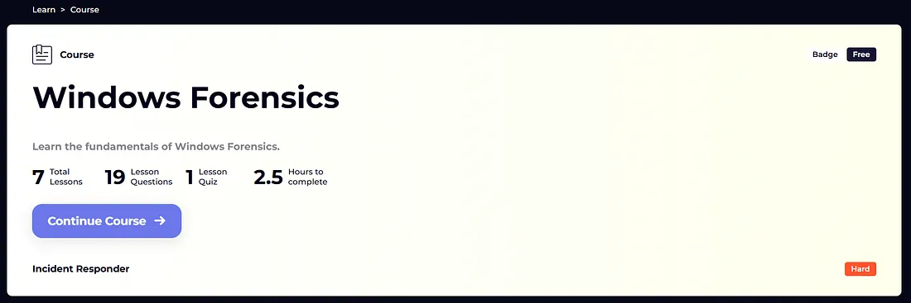

# Windows Forensics Lab – LetsDefend

## Description
This repository contains the lab files and my solution for the Windows Forensics lab from LetsDefend.  
The lab covers analysis of important Windows forensic artifacts, including:

- MFT (Master File Table)  
- USN Journal  
- LNK Files  
- Prefetch Files  
- Windows Notification Database  

This write-up is useful for beginners in Digital Forensics and DFIR who want to understand how to analyze real artifacts step by step.

---

## Preview

## Write-up
You can find the full detailed write-up here:  
👉 [Medium Article](https://medium.com/@0xgbreil/windows-forensics-course-letsdefend-26ff3611a9b3)

---

## Lab Files

The lab files are compressed and password protected for safety reasons.

- Format: .rar  
- Password: infected  

After downloading, extract the files and use them for analysis.
---

## Tools Used

This lab was analyzed using the following tools:

- **MFTECmd** – For analyzing $MFT artifacts  
- **Timeline Explorer** – For viewing and filtering CSV timelines  
- **LECmd** – For analyzing LNK shortcut files  
- **PECmd** – For analyzing Prefetch files  
- **DB Browser for SQLite** – For analyzing Windows Notification database  

🔗 Eric Zimmerman Tools: https://ericzimmerman.github.io/#!index.md  
🔗 DB Browser for SQLite: https://sqlitebrowser.org/dl/
---

## Connect with me
- LinkedIn: [LinkedIn](https://www.linkedin.com/in/0xgbreil/)
- Medium: [Medium](https://medium.com/@0xgbreil)
- X (Twitter): [X](https://x.com/0xgbreil)
